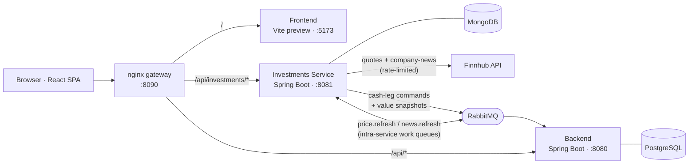
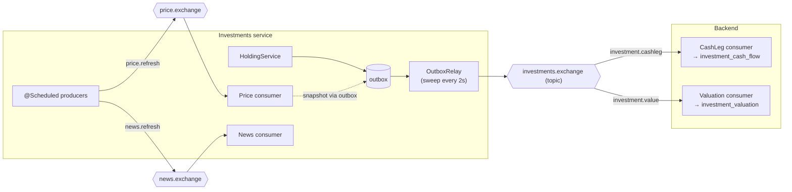
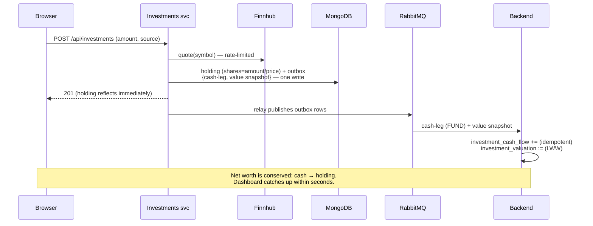

# System Design & Architecture

Authoritative, current-state view of the whole system: the services, their data stores, how
requests are routed, how the services talk to each other, and the key runtime flows. For
per-resource detail see [DATA_MODEL.md](DATA_MODEL.md) and [API.md](API.md); for the module-internal
package layouts see [ARCHITECTURE.md](ARCHITECTURE.md); for the design records behind the investments
work see [INVESTMENTS_SERVICE.md](INVESTMENTS_SERVICE.md), [INVESTMENT_PRICING.md](INVESTMENT_PRICING.md),
and [INVESTMENT_NEWS.md](INVESTMENT_NEWS.md).

## Status

| Area | State |
|---|---|
| Transactions, budgets, dashboard metrics | **Built** — backend (Postgres) |
| Investments: share-based holdings, buy / cash-out / correction / manual price | **Built** — investments service (MongoDB) |
| Automated pricing (Finnhub, rate-limited, every 15 min) | **Built** |
| Portfolio news feed (Finnhub company-news, every 4h + on held-set change) | **Built** |
| Inter-service messaging (RabbitMQ: cash-leg commands + value snapshots, outbox) | **Built** |
| nginx gateway (single origin) | **Built** |
| Light/dark theme switch | **Built** |
| Auth, multi-currency, valuation history, Flyway migrations | **Not built** (see [Roadmap](#roadmap--deferred)) |

The system started as a monolith (Spring Boot + Postgres + React) and investments were later
**extracted into their own service** with a MongoDB and a Finnhub price/news integration, talking to
the backend **only over RabbitMQ**. That extraction is the defining architectural decision below.

## Topology



Two Spring Boot services, two databases (polyglot persistence), one broker, one gateway, one SPA.
The **backend never calls the investments service**; all cross-service data flows one way over
RabbitMQ. The browser sees a **single origin** (the gateway).

## Components

| Component | Tech | Port | Responsibility | Store |
|---|---|---|---|---|
| **Frontend** | React 18 + TS, Vite 5, React Router 6 | 5173 | SPA: Dashboard, Transactions, Investments | — |
| **Gateway** | nginx | 8090 | Single-origin reverse proxy (frontend + both APIs) | — |
| **Backend** | Spring Boot 3.3 / Java 21, Spring Data JPA | 8080 | Transactions, budgets, dashboard metrics; owns every dashboard number | PostgreSQL 16 |
| **Investments service** | Spring Boot 3.3 / Java 21, Spring Data MongoDB, Spring AMQP | 8081 | Holdings, share-based valuation, pricing job, news feed, Finnhub integration | MongoDB 7 |
| **Broker** | RabbitMQ 3.13 | 5672 / 15672 | Inter-service messaging + intra-service work queues | — |
| **Provider** | Finnhub (external) | — | Stock quotes + company news (free tier, 60 calls/min) | — |

## Data ownership

Each datum has exactly one owner. The backend keeps **message-fed projections** of the investing
data it needs for the dashboard — it never reaches into the service's store.

| Data | Owner | Store | Collection / table |
|---|---|---|---|
| Transactions, budgets | Backend | Postgres | `transactions`, `budgets` (+ `budget_categories`) |
| Investing cash movements (for cash balances + `netInvestment`) | Backend projection | Postgres | `investment_cash_flow` (PK = message `eventId`) |
| Investing net value (for the dashboard INVESTING balance) | Backend projection | Postgres | `investment_valuation` (singleton, last-write-wins) |
| Holdings (shares, avg-cost, value, events) | Investments service | Mongo | `holdings` |
| Outbound messages (reliable publish) | Investments service | Mongo | `outbox` |
| News feed (ranked ≤7 items) | Investments service | Mongo | `news_feed` (singleton) |

Full field-level schemas: [DATA_MODEL.md](DATA_MODEL.md) (Postgres) and
[INVESTMENT_NEWS.md § MongoDB data model](INVESTMENT_NEWS.md#mongodb-data-model-investments-service) (Mongo).

## Request routing

The gateway peels routes off by longest-prefix match, so the browser only ever talks to `:8090`:

| Path | Upstream |
|---|---|
| `/api/investments/**` (incl. `/summary`, `/news`) | investments service `:8081` |
| `/api/**` (transactions, budgets, balances) | backend `:8080` |
| `/**` | frontend `:5173` |

In local dev (no gateway) the Vite dev server does the same split via `server.proxy`
(`/api/investments` → 8081, `/api` → 8080). The frontend is built with an empty
`VITE_API_BASE_URL` so it uses **relative** URLs against whatever origin serves it (the gateway).

## Inter-service messaging

All backend↔service communication is over RabbitMQ — **no synchronous HTTP between services**. Two
streams flow service → backend on one topic exchange, plus intra-service work queues.



| Stream | Nature | Delivery guarantee |
|---|---|---|
| **Cash-leg command** (`InvestmentFunded` / `InvestmentCashedOut`) | incremental — must apply exactly once | **outbox** on the service + **idempotent** backend consumer (PK = `eventId`) |
| **Value snapshot** (`InvestmentNetValue`) | state — full current value | **last-write-wins** by `asOf`; a lost intermediate self-heals on the next snapshot |
| **`price.refresh`** (intra-service) | work item per symbol | listener retry → **DLQ** → mark `STALE`, keep last price |
| **`news.refresh`** (intra-service) | rebuild trigger | direct best-effort publish; a lost trigger self-heals at the next 4h tick |

The investments service **owns the message contract** (`InvestmentsMessaging` + the `contract`
records); the backend keeps consumer-side mirror records guarded by a JSON-fixture contract test.

## Key flows

### Buy a stock (eventual consistency via outbox)



### Dashboard read (stale-but-coherent net worth)

The backend serves the whole dashboard from **local** state — cash balances from transactions,
investing cash flows and investing value from its two projections. It does **not** call the service,
so net worth is a single coherent number even if the service is down (just possibly a few seconds
stale). `netWorth = checking + savings + investing`; formulas in [DATA_MODEL.md](DATA_MODEL.md).

### Price refresh (self-contained, every 15 min)

`@Scheduled` producer enqueues one `price.refresh` per held, resolvable symbol → rate-limited
consumer calls Finnhub → updates holdings + emits a value snapshot (→ backend). Transient failures
retry then dead-letter to `STALE` (last price kept); unknown symbols → `UNRESOLVED` (never fetched,
priced by hand). See [INVESTMENT_PRICING.md](INVESTMENT_PRICING.md).

### News refresh (every 4h + on held-set change)

`@Scheduled` producer, plus a trigger on a **new-symbol buy or a full cash-out**, publishes
`news.refresh` → consumer fetches company-news per holding (shared rate limiter) and rebuilds a
ranked ≤7-item feed via a **value-weighted stock draw** (bigger positions get higher odds; seeded
RNG). Best-effort: a total fetch failure keeps the previous feed. See
[INVESTMENT_NEWS.md](INVESTMENT_NEWS.md).

## Consistency & resilience

- **Eventual consistency** between the service and the backend, bounded to seconds. The service is
  the source of truth for holdings; the backend's projections trail it.
- **Exactly-once effect** on cash legs: outbox (at-least-once publish) + idempotent consumer keyed
  by `eventId` (a duplicate is a no-op — one row per event).
- **Self-healing value:** snapshots are last-write-wins by `asOf`, so lost/reordered intermediates
  don't matter.
- **Failure isolation:** if the investments service or broker is down, the backend still serves the
  dashboard (last snapshot) and all non-investment features; buys/sells and the Investments page are
  unavailable until it returns. News failures degrade only the feed.
- **Rate limiting** is the real governor of Finnhub usage — a shared token bucket paces both the
  periodic jobs and buy-time quotes under the 60/min free tier.

## Deployment

`docker-compose.yml` runs seven services: `postgres`, `mongodb`, `rabbitmq`, `backend`,
`investments-service`, `frontend`, `gateway`. Health-gated startup order (backend waits for Postgres
+ RabbitMQ; the service waits for Mongo + RabbitMQ). Config via env (`.env`, gitignored) — DB creds,
broker creds, `FINNHUB_API_KEY`, and the job cadences/knobs.

### Production

The production stack is publicly available at **https://big4finance.online** via a Cloudflare
tunnel. The tunnel points at the nginx gateway on the host. Run with:

```bash
make build && make up   # images → containers, detached
```

### Test environment

A local test stack can run alongside production without touching the Cloudflare tunnel. It uses
the same `docker-compose.yml` but a separate Docker Compose project name (`big4-test`) and
`.env.test`, which offsets every host-bound port by ~1000. Volumes and networks are namespaced
separately (`big4-test_*`), so data is completely isolated. RabbitMQ uses a distinct Erlang cookie
(`RABBITMQ_ERLANG_COOKIE=test-cookie`) to avoid EPMD node collisions when both instances run on
the same host.

```bash
make build-test && make up-test   # test images → test containers
# App available at http://localhost:9090
```

Full port mapping and all Makefile targets: [README.md](../README.md).

> Operational note: nginx resolves upstream hostnames at startup, so after rebuilding a service
> container (new IP) the gateway may need `docker compose restart gateway` (or
> `make restart` / `make restart-test`). A dynamic-resolver config would remove this; not yet done.

## Testing

Both Spring modules have layered suites (fast Surefire unit/slice + Testcontainers Failsafe
integration). The provider adapters are tested with `MockRestServiceServer` (this environment can't
open the loopback selector pipe an embedded HTTP mock needs). Full breakdown and counts:
[TESTING.md](TESTING.md).

## Design rationale & trade-offs

- **Why extract a service?** The roadmap (news feed, a document-shaped per-holding aggregate) fits a
  document store, and encapsulating the external Finnhub integration behind one service keeps the
  backend free of third-party coupling. It was also a deliberate exploration of a
  messaging-first, polyglot architecture.
- **Why messaging-only (no sync HTTP)?** The backend stays up and serves a coherent dashboard when
  the service is down; there is no runtime request coupling. The cost — eventual consistency — is
  bounded to seconds and acceptable for a single user.
- **Why a backend shallow copy of the investing value** (rather than the frontend composing a live
  read)? A single message-fed number is *stale-but-coherent*; composing a fresh investing read with
  lagging backend cash would transiently **inflate net worth** right after a buy.
- **Honest cost:** two services + two datastores + a broker + a gateway is heavy for a single-user
  app. It's justified by the roadmap and the learning goal, and called out so the complexity is a
  choice, not an accident. A Mongo-backed module inside the monolith would deliver the same features
  with far less machinery.

## Roadmap / deferred

Auth (Spring Security), user-manageable accounts/categories, recurring transactions, multi-currency,
a price-history table for true historical net worth, realized-gain reporting UI, Flyway migrations,
and a dynamic-resolver gateway config. Shelved feature spec:
[future/STATEMENT_IMPORT.md](future/STATEMENT_IMPORT.md).
